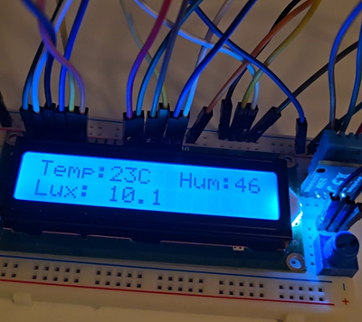
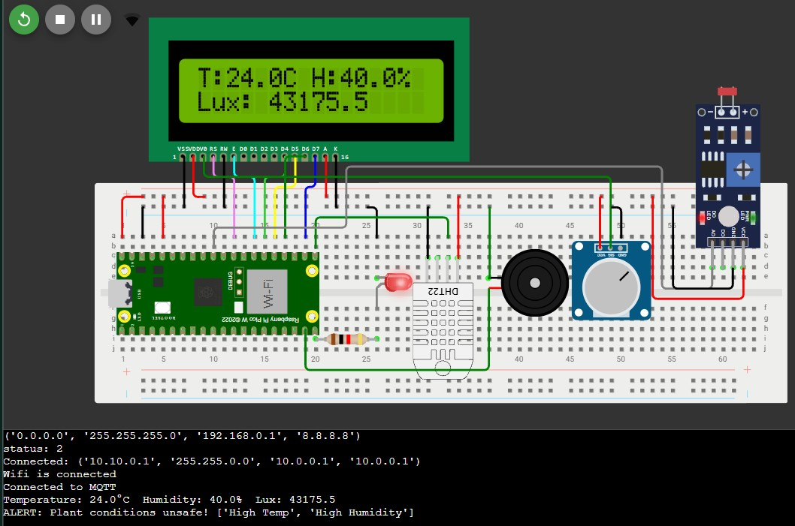
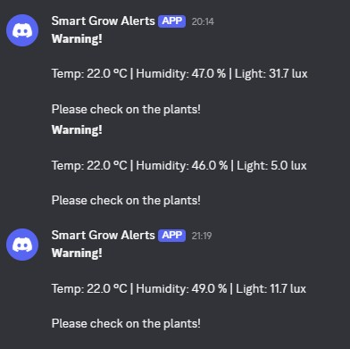

# πCo – Smart Plant Environmental Monitor (Edge IoT)

An edge computing telemetry and alerting pipeline built with the Raspberry Pi Pico W. The device monitors climate and lighting conditions, evaluates environmental thresholds locally on edge, drives localized alarms, and streams readings to a containerized TimescaleDB and Grafana stack. **It also features automated Discord alerts for remote monitoring.**

---

## 📸 Project Screenshots

* **Hardware Setup:** <br>
  

* **Wokwi Simulation:** <br>
  

* **Discord Alert:** <br>
  

---

## 🏗️ Architecture & Pipeline

```text
[ Pico W (DHT11, APDS-9999 Light Sensor, LCD, Buzzer/LED) ]
                      │
                      ▼ (Wi-Fi / JSON MQTT)
             [ Mosquitto Broker ]
                      │
                      ▼
              [ Python Consumer ] ───► [ Discord Webhook Alerts ]
                      │
                      ▼
                [ TimescaleDB ]
                      │
                      ▼
              [ Grafana Dashboard ]
```

Pipeline flow: Edge sensing & alert → MQTT ingestion → TimescaleDB storage → Grafana visualization.

## Project Structure

```
├── docs/
│   └── way-of-working.md        # Agile process, branching, and PR rules
├── src_pico/
│   ├── umqtt/simple.py          # MicroPython MQTT client
│   ├── wifi_credentials.json    # Local network secrets (gitignored)
│   ├── wifi.py                  # RP2 Wi-Fi initialization helper
│   └── main.py                  # Measurement loop, alert logic & publisher
├── src_pipeline/
│   ├── dockerfiles/
│   │   └── consumer.dockerfile  # Optimized uv-based consumer image
│   ├── utils/
│   │   └── connect_postgres.py  # Parameterized TimescaleDB client
│   ├── consumer.py              # MQTT subscriber & database ingestion worker
│   ├── docker-compose.yaml      # Mosquitto, TimescaleDB, consumer & Grafana
│   ├── .env.example
│   └── .env                     # Local secrets (gitignored)
├── .gitignore
├── pyproject.toml
├── README.md
└── uv.lock
```

## Hardware & Bill of Materials (BOM)

| Component | Pin / Interface | Role |
| :--- | :--- | :--- |
| **Raspberry Pi Pico W** | Microcontroller | Edge compute node & Wi-Fi MQTT publisher |
| **DHT11 Sensor** | GPIO 16 | Temperature and relative humidity monitoring |
| **LDR Photoresistor**| ADC Pin (GPIO 26) | Ambient light intensity tracking |
| **I2C Display (LCD/OLED)** | I2C (SDA / SCL) | Real-time local status display (Bonus) |
| **Active Buzzer & LED**| GPIO 14 (PWM) / GPIO 15 | Local threshold breach alarm (audio-visual) |

---
## Edge Features & Logic

* **Local Safety Validation:** Autonomous edge checks (`temp > 10°C` or `hum > 10%`) trigger a local buzzer routine and warning LED without network round-trip dependencies.
* **Fail-Safe Telemetry:** Auto-reconnect routines handle intermittent Wi-Fi and MQTT broker outages.
* **Wokwi Edge Simulation:** Circuit schematic and functional simulation available at [Wokwi Project](https://wokwi.com/projects/475319091061769217).

---

## Quickstart

### Prerequisites
* [Docker & Docker Compose](https://docs.docker.com/get-docker/) installed and running.
* [Raspberry Pi Pico W](https://www.raspberrypi.com/documentation/microcontrollers/raspberry-pi-pico.html) flashed with the latest MicroPython UF2 firmware.
* VS Code with the **MicroPico** extension (or Thonny IDE).

---

### 1. Launch Data Pipeline

1. **Configure Environment:**
   ```bash
   cd src_pipeline
   cp .env.example .env
   ```

Open `.env` and configure your credentials according to the template in [`.env.example`](./src_pipeline/.env.example).

**Start Services:**

```bash
docker compose up -d --build
```

* Mosquitto starts on port 1883.
* TimescaleDB completes its healthcheck and exposes port 5432.
* The Python consumer waits for healthy upstream services, auto-initializes the `sensor_readings` table, and subscribes to incoming messages.

**Verify Pipeline:**

```bash
docker compose logs -f consumer
```

---

### 2. Configure & Flash Pico W

1. Create `src_pico/wifi_credentials.json` (gitignored) and add your local network credentials:
   ```json
   {
     "ssid": "YOUR_WIFI_NAME",
     "password": "YOUR_WIFI_PASSWORD"
   }
   ```
2. In `src_pico/main.py`, set `MQTT_BROKER` to your Docker host IP (use your machine's local LAN IP, e.g., `192.168.1.X`, not `localhost`).
3. Open the repository root in VS Code using the **MicroPico** extension, connect the Pico W via USB, and upload the `src_pico/` folder to the device.
4. Run `main.py`. Telemetry will stream to Mosquitto, and the local buzzer/LED alarm will fire if thresholds are exceeded.

---


## Observability & Dashboard

Access the live dashboard at `http://localhost:3000` (Log in using the `GRAFANA_USER` and `GRAFANA_PASSWORD` defined in your `.env` file).
*(The TimescaleDB data source and dashboards are auto-provisioned).*

* **Tracked Metrics:** Temperature (°C), Humidity (%), Light Level, and Alert Breaches.
* **Visualizations:** Real-time time-series charts, environment gauges, and alert indicators.

---

## Contributors

* **[Lilit Ajoyan](https://github.com/LAjoyan)**
* **[Josefin Lesley](https://github.com/Josefin3647)**
* **[Leo Lindqvist Kröhnert](https://github.com/LeoLindqvist123)**
* **[Erfan Tahmasebi](https://github.com/erfantk25-lab)**